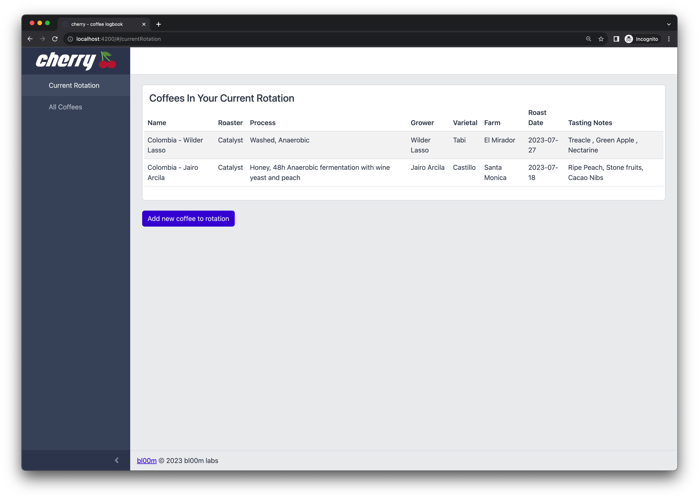
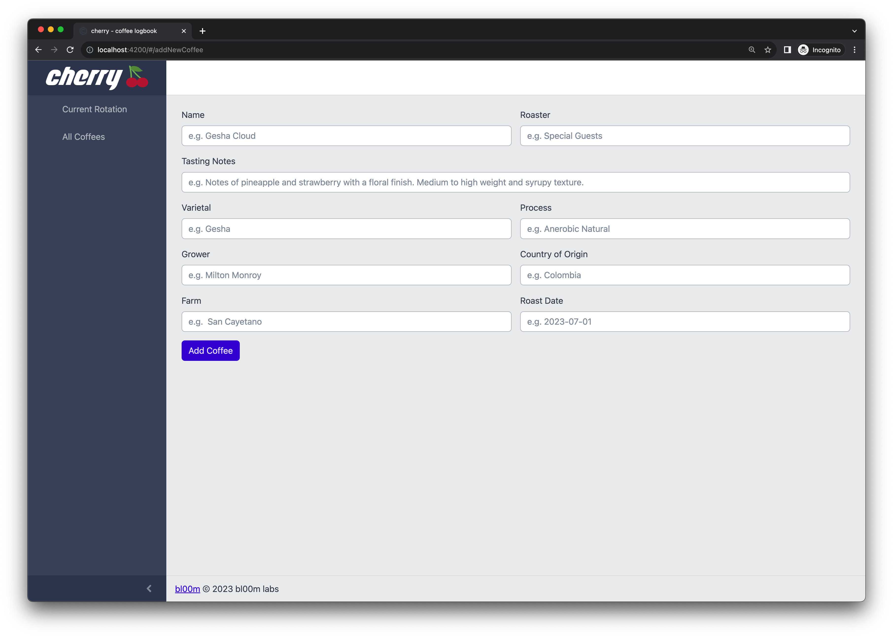
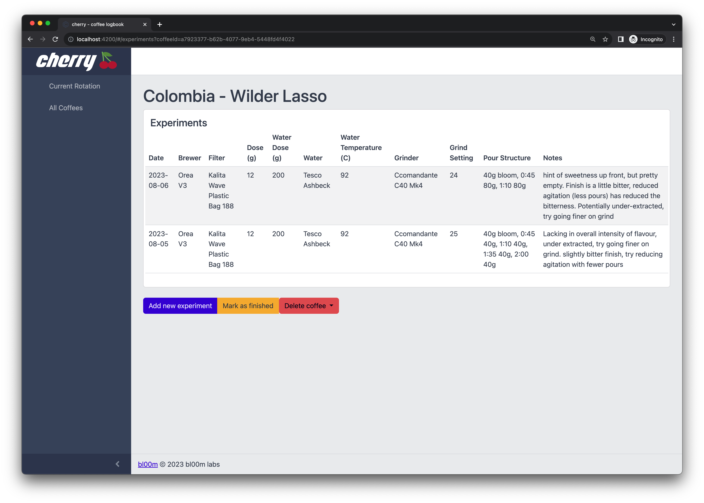
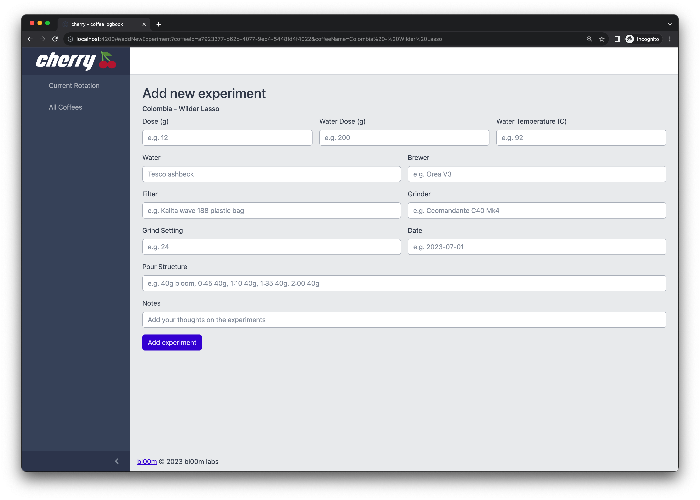

  

cherry is a logbook app for recording home brewing coffee experiments named after the fruit from which coffee is derived. 

## Screenshots

Cherry can be used to track the coffees you're currently brewing

You can add new coffees

Cherry can also be used to track experiment with brewing so that you can track the impact variables have on each cup

## Installing 

TODO

## Roadmap

Below are the roadmaps for both front and backend features

### Frontend

- [ ] Editing a coffee
- [ ] Editing an experiment
- [ ] Marking a coffee as a favorite 
- [ ] Marking an experiment as a favorite 

### Backend

- [ ] Tracking favorite coffees 
- [ ] Tracking favorite experiments 
